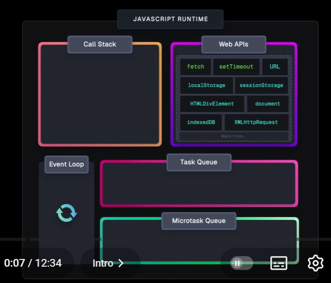

# JavaScript Interview Guide

## What is the Event Loop?

The event loop is what allows Node.js to perform non-blocking I/O operations — despite the fact that a single JavaScript thread is used by default — by offloading operations to the system kernel whenever possible.

### Key Components:

- **Call Stack** (Synchronous code)
- **Microtask Queue** (Promises)
- **Macrotask Queue** (setTimeout, events)


## Call Stack (Synchronous code)

- Executes synchronous code
- LIFO (Last In, First Out)

## Web APIs (Browser / Node)

Handles async tasks like:

- `setTimeout`
- `setInterval`
- `fetch`
- DOM events

## Microtask Queue (High Priority)

- `Promise.then`
- `catch`
- `finally`
- `MutationObserver`
- `queueMicrotask`

## Macrotask Queue (Task Queue)

- `setTimeout`
- `setInterval`
- `setImmediate`
- UI events

## Event Loop

- Watches Call Stack
- Pushes tasks when stack is empty

### Example

```javascript
function logA() { console.log('A') }
function logB() { console.log('B') }
function logC() { console.log('C') }
function logD() { console.log('D') }

logA();
setTimeout(logB, 0);
Promise.resolve().then(logC);
logD();
```

**Output:** A D C B

### Visual Reference



For interactive learning, visit: https://www.jsv9000.app/