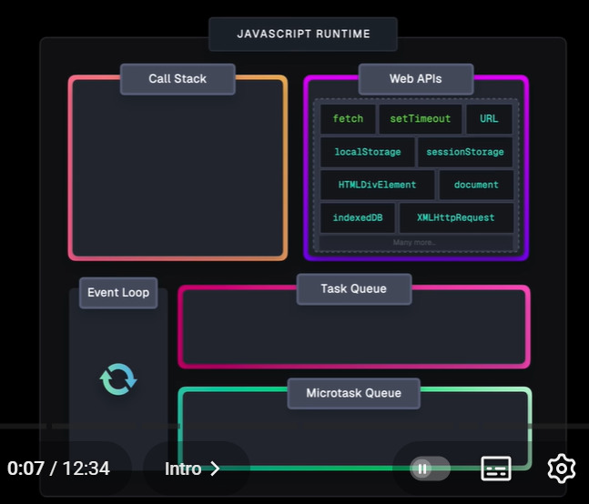
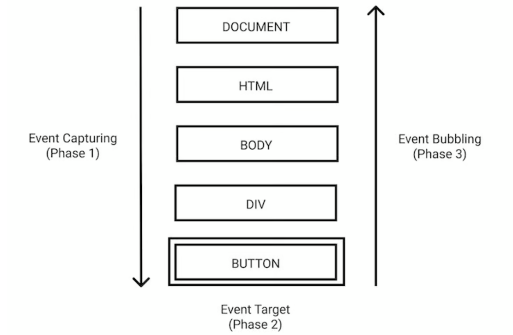
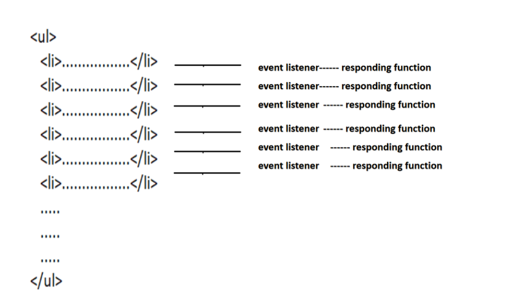
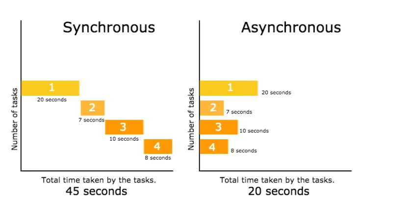

# JavaScript Interview Guide

## Table of Contents
1. [What is the Event Loop?](#1-what-is-the-event-loop)
2. [What is "this" in JavaScript?](#2-what-is-this-in-javascript)
3. [What is Hoisting?](#3-what-is-hoisting)
4. [What is a Closure?](#4-what-is-a-closure)
5. [What is Memory Allocation?](#5-what-is-memory-allocation)
6. [What is Event Propagation?](#6-what-is-event-propagation)
7. [What is Event Delegation?](#7-what-is-event-delegation)
8. [What is a Callback Function?](#8-what-is-a-callback-function)
9. [Callbacks vs Promises vs Async/Await](#9-callbacks-vs-promises-vs-asyncawait)
10. [Event Loop with Callbacks](#10-event-loop-with-callbacks)
11. [ES6 Features](#11-es6-features)
12. [Spread Operator vs Rest Operator](#12-spread-operator-vs-rest-operator)
13. [var vs let vs const](#13-var-vs-let-vs-const)
14. [Promises in JavaScript](#14-promises-in-javascript)
15. [Synchronous vs Asynchronous JavaScript (with Examples)](#15-synchronous-vs-asynchronous-javascript-with-examples)


---
<br>
<br>
<br>

## 1. What is the Event Loop?

Event Loop is a core JavaScript mechanism that allows asynchronous, non-blocking execution in a single-threaded language by continuously monitoring the Call Stack, Microtask Queue, and Callback (Task) Queue, and deciding when and what to execute next.

### Key Components

- **Call Stack** (Synchronous code)
  - Executes synchronous code
  - LIFO (Last In, First Out)
- **Microtask Queue** (Promises)
  - `Promise.then`
  - `catch`
  - `finally`
  - `MutationObserver`
  - `queueMicrotask`
- **Macrotask Queue** (setTimeout, events)
  - `setTimeout`
  - `setInterval`
  - `setImmediate`
  - UI events


### Event Loop

- Watches Call Stack
- Pushes tasks when stack is empty

### Example

```javascript
function logA() { console.log('A') }
function logB() { console.log('B') }
function logC() { console.log('C') }
function logD() { console.log('D') }

logA();
setTimeout(logB, 0);
Promise.resolve().then(logC);
logD();
```

**Output:** `A D C B`

### Visual Reference



For interactive learning, visit: [JS Visualizer](https://www.jsv9000.app/)

---
<br>
<br>
<br>

## 2. What is "this" in JavaScript?

`this` is a special keyword in JavaScript that refers to the execution context of a function.
Its value is not fixed at definition time; it is determined at runtime, based on how a function is called.

> "this in JavaScript refers to the object that is currently executing the function, and its value is determined by how the function is called, not where it is defined."

### How "this" Works in Different Scenarios

#### 1. Global Context

In browsers, `this` refers to the global object (`window`).
In strict mode, `this` is `undefined`.

```javascript
console.log(this); // window (non-strict), undefined (strict)
```

#### 2. Inside a Regular Function

Depends on how the function is invoked.

```javascript
function show() {
  console.log(this);
}
show(); // window (non-strict), undefined (strict)
```

#### 3. Method Invocation (Object Context)

When a function is called as an object method, `this` refers to the object before the dot.

```javascript
const user = {
  name: 'Abhi',
  greet() {
    console.log(this.name);
  }
};

user.greet(); // Abhi
```

#### 4. Arrow Functions

Arrow functions do **not** have their own `this`.
They inherit `this` from the lexical (outer) scope.

```javascript
const obj = {
  value: 10,
  arrow: () => {
    console.log(this.value);
  }
};

obj.arrow(); // undefined (or global value)
```

#### 5. Constructor Functions (new)

When a function is called using `new`, `this` refers to the newly created object.

```javascript
function Person(name) {
  this.name = name;
}

const p1 = new Person('Rahul');
console.log(p1.name); // Rahul
```

#### 6. Explicit Binding (call, apply, bind)

You can manually set the value of `this`.

```javascript
function greet(city) {
  console.log(this.name + ' from ' + city);
}

const user = { name: 'Amit' };

greet.call(user, 'Pune');
greet.apply(user, ['Mumbai']);

const boundFn = greet.bind(user, 'Delhi');
boundFn();
```

#### 7. Event Handlers

In normal functions, `this` refers to the element that triggered the event.
In arrow functions, `this` comes from the outer scope.

```javascript
button.addEventListener('click', function () {
  console.log(this); // button
});

button.addEventListener('click', () => {
  console.log(this); // window
});
```

### "this" in Classes

In classes, `this` refers to the instance of the class.

```javascript
class Car {
  constructor(name) {
    this.name = name;
  }

  show() {
    console.log(this.name);
  }
}

const car = new Car('BMW');
car.show(); // BMW
```

### Common Interview Traps

- `this` is not the function itself.
- `this` is not where the function is defined.
- Arrow functions cannot be used as constructors.
- `bind()` returns a new function, it does not execute immediately.

---
<br>
<br>
<br>

## 3. What is Hoisting?

Hoisting is a JavaScript behavior where variable and function declarations are moved to the top of their scope during the compilation phase, before code execution.

Hoisting is JavaScript’s default behavior of moving declarations to the top of their scope before execution, allowing functions and `var` variables to be used **before** they are defined.

**Note:** Only declarations are hoisted, not initializations.

### How Hoisting Works Internally

JavaScript code runs in two phases:
1. **Memory Creation Phase**: JS engine scans the code and allocates memory for variables and functions.
2. **Execution Phase**: Code runs line by line.

During the memory phase:
- `var` is initialized as `undefined`.
- `let` and `const` are hoisted but not initialized (Temporal Dead Zone).
- Function declarations are fully hoisted.

### Variable Hoisting

#### var
Hoisted and initialized with `undefined`.

```javascript
console.log(a); // undefined
var a = 10;
```

#### let
Hoisted but kept in the **Temporal Dead Zone (TDZ)**.
Accessing before declaration throws an error.

```javascript
console.log(b); // ReferenceError
let b = 20;
```

#### const
Same as `let`. Must be initialized at declaration.

```javascript
console.log(c); // ReferenceError
const c = 30;
```

### Function Hoisting

#### Function Declaration
Fully hoisted (can be called before definition).

```javascript
sayHello(); // Hello

function sayHello() {
  console.log('Hello');
}
```

#### Function Expression
Depends on variable type.

```javascript
sayHi(); // TypeError: sayHi is not a function

var sayHi = function () {
  console.log('Hi');
};
```

With `let` / `const`:

```javascript
sayHi(); // ReferenceError

const sayHi = () => {
  console.log('Hi');
};
```

### Class Hoisting
Classes are hoisted but remain in TDZ. Cannot be used before declaration.

```javascript
const obj = new Car(); // ReferenceError

class Car {}
```

### Temporal Dead Zone (TDZ)
Time between entering scope and variable declaration. Applies to `let`, `const`, and `class`.

### Common Interview Mistakes
- Hoisting does not move code physically.
- Only declarations are hoisted.
- Arrow functions are not hoisted like function declarations.
- `let` and `const` prevent unsafe access via TDZ.

---
<br>
<br>
<br>

## 4. What is a Closure?

A closure is created when a function remembers and continues to access variables from its lexical scope, even after the outer function has finished execution.

In simple words: **A function bundled with its surrounding state (scope) is called a closure.**

### Why Closures Exist
JavaScript functions form lexical scopes. When a function is defined inside another function, it captures variables of the outer function.

### Basic Closure Example

```javascript
function outer() {
  let count = 0;

  function inner() {
    count++;
    console.log(count);
  }

  return inner;
}

const fn = outer();
fn(); // 1
fn(); // 2
fn(); // 3
```

**How it works:**
- `outer()` executes and returns `inner`.
- `count` is stored in memory.
- `inner()` still has access to `count`.
- Each call updates the same `count`.

### How Closure Works Internally
- JS creates a Lexical Environment for `outer`.
- `inner` stores a reference, not a copy, to `count`.
- Even after `outer` finishes, its variables remain in memory.
- Memory is released only when no closure references exist.

### Closure with Parameters

```javascript
function multiply(x) {
  return function (y) {
    return x * y;
  };
}

const double = multiply(2);
console.log(double(5)); // 10
```

### Closure with Private Variables

```javascript
function counter() {
  let value = 0;

  return {
    increment() {
      value++;
    },
    get() {
      return value;
    }
  };
}

const c = counter();
c.increment();
console.log(c.get()); // 1
```

### Closure in Loops (Interview Trap)

```javascript
for (var i = 0; i < 3; i++) {
  setTimeout(() => console.log(i), 1000);
}
// Output: 3 3 3
```

**Fix using let:**

```javascript
for (let i = 0; i < 3; i++) {
  setTimeout(() => console.log(i), 1000);
}
// Output: 0 1 2
```

### Real-World Uses of Closures
- Data encapsulation / private variables
- Function factories
- Memoization
- Event handlers
- Callbacks and async code

### Common Interview Mistakes
- Closure does not copy values, it keeps references.
- Closure is created at function creation, not execution.
- Every function is not a closure, only those accessing outer variables.


### Closure Output-Based Questions

---
<br>
<br>
<br>

#### Question 1
```javascript
function outer() {
  let x = 10;
  return function inner() {
    console.log(x);
  };
}

const fn = outer();
fn();
```
**Output:** `10`
**Explanation:** `inner()` forms a closure over `x`.

---
<br>
<br>
<br>

#### Question 2
```javascript
function outer() {
  let count = 0;
  return function () {
    count++;
    console.log(count);
  };
}

const a = outer();
const b = outer();

a();
a();
b();
```
**Output:**
```
1
2
1
```
**Explanation:** Each call to `outer()` creates a separate closure with its own `count`.

---
<br>
<br>
<br>

#### Question 3 (Common Trap)
```javascript
for (var i = 0; i < 3; i++) {
  setTimeout(() => console.log(i), 0);
}
```
**Output:** `3 3 3`
**Why:** `var` is function-scoped. All callbacks share the same `i` reference.

---
<br>
<br>
<br>

#### Question 4 (Fix)
```javascript
for (let i = 0; i < 3; i++) {
  setTimeout(() => console.log(i), 0);
}
```
**Output:** `0 1 2`
**Why:** `let` creates a new binding per iteration.

---
<br>
<br>
<br>

#### Question 5
```javascript
function create() {
  let x = 5;
  return function (y) {
    console.log(x + y);
  };
}

create()(10);
```
**Output:** `15`

### Memory Leak Issues with Closures
A memory leak occurs when a closure holds references to variables that are no longer needed, preventing garbage collection.

#### Example of a Closure Memory Leak
```javascript
function hugeData() {
  const bigArray = new Array(1000000).fill('*');

  return function () {
    console.log(bigArray.length);
  };
}

const fn = hugeData();
```
**Problem:** `bigArray` stays in memory because the closure keeps a reference to it.

#### How to Prevent Closure Memory Leaks
1. **Remove Event Listeners**: `element.removeEventListener('click', handler);`
2. **Nullify Unused References**: `bigArray = null;`
3. **Avoid Capturing Large Objects**: Capture only required data.

### Closures vs Scope Chain

| Aspect | Scope Chain | Closure |
| :--- | :--- | :--- |
| What it is | Variable lookup mechanism | Function + preserved scope |
| Exists when | During execution | Even after outer function ends |
| Memory | Temporary | Persistent |
| Purpose | Resolve identifiers | Preserve state |

---
<br>
<br>
<br>

## 5. What is Memory Allocation?

Memory allocation in JavaScript is the process of reserving memory for variables, functions, and objects, and later releasing it when no longer needed.
JavaScript handles memory automatically using a garbage collector.

### JavaScript Memory Lifecycle
1. **Allocate memory**
2. **Use memory**
3. **Release memory (Garbage Collection)**

### 1. Memory Allocation Phase (Creation Phase)
Before code executes, the JavaScript engine creates memory.

```javascript
let a = 10;
let b = { x: 20 };
```
- `a` (primitive) → stored in **stack**.
- `b` (object reference) → reference in **stack**, object in **heap**.

### 2. Stack vs Heap Memory

**Stack Memory**
- Stores: Primitive values, Function call frames, References to heap objects.
- Fast & fixed size.

**Heap Memory**
- Stores: Objects, Arrays, Functions, Closures.
- Dynamic & slower than stack.

### 3. Execution Context & Memory
Each function call creates an **Execution Context** containing Variable Environment, Lexical Environment, and Scope Chain reference.

### 4. Memory Allocation in Closures
Variables captured by closures stay in the **heap** and are not garbage collected as long as the closure exists.

### 5. Garbage Collection (GC)
JavaScript uses the **Mark-and-Sweep** algorithm.
- Start from root objects.
- Mark all reachable objects.
- Unreachable objects are removed.

### 6. Memory Leaks in JavaScript
- Closures holding large objects.
- Unremoved Event Listeners.
- Global Variables.

---
<br>
<br>
<br>

## 6. What is Event Propagation?

Event propagation describes the order in which events travel through the DOM tree when an event occurs.

There are three phases:
1. **Capturing phase**
2. **Target phase**
3. **Bubbling phase**

### 1. Event Capturing (Trickling Phase)
Event starts from the root (document) and moves **downward** to the target element. Rarely used in practice.

```javascript
parent.addEventListener('click', handler, true); // capture = true
```

### 2. Event Bubbling
Event starts from the target element and moves **upward** to ancestors. This is the **default behavior**.

```javascript
child.addEventListener('click', handler);
```

### Example Showing Both

```javascript
parent.addEventListener('click', () => console.log('Parent'));
child.addEventListener('click', () => console.log('Child'));
```

**Output when clicking button:**
1. Child
2. Parent

**Order:**
Document ↓ (capturing) Parent ↓ Target ↑ Parent ↑ (bubbling) Document

### 3. Target Phase
The event reaches the actual element where the action occurred.

### How to Prevent Event Bubbling / Capturing

#### `event.stopPropagation()`
Stops event from moving further up or down the DOM.

```javascript
child.addEventListener('click', (e) => {
  e.stopPropagation();
  console.log('Child only');
});
```

#### `event.stopImmediatePropagation()`
Stops bubbling AND stops other listeners on the same element.

#### `event.preventDefault()`
Prevents default browser behavior (e.g., submitting a form, following a link) but **does NOT stop propagation**.

### Capturing vs Bubbling

| Feature | Capturing | Bubbling |
| :--- | :--- | :--- |
| Direction | Top → Bottom | Bottom → Top |
| Default | No | Yes |
| Use case | Rare | Common |
| Enable | `addEventListener(..., true)` | Default |

---
<br>
<br>
<br>

## 7. What is Event Delegation?

Event delegation is a technique where a **single event listener** is attached to a **parent element** instead of adding listeners to multiple child elements. It leverages **event bubbling**.



### Why Event Delegation Is Used
- Improves performance (fewer listeners).
- Reduces memory usage.
- Handles dynamically added elements.
- Cleaner code.

### Bad Practice (Without Delegation)
```javascript
const items = document.querySelectorAll('li');

items.forEach(item => {
  item.addEventListener('click', () => {
    console.log(item.textContent);
  });
});
```
- **Wrong:** Multiple listeners, doesn't work for new items.

### Best Practice (With Delegation)
```javascript
const list = document.querySelector('ul');

list.addEventListener('click', (e) => {
  if (e.target.tagName === 'LI') {
    console.log(e.target.textContent);
  }
});
```
- **Correct:** Single listener, works for dynamic elements.

### How it Works
1. Event occurs on child.
2. Event bubbles up to parent.
3. Parent listener catches it.
4. `event.target` identifies the actual element.

### Key Properties
- `event.target`: Element that triggered event.
- `event.currentTarget`: Element with listener.

---
<br>
<br>
<br>

## 8. What is a Callback Function?

A callback function is a function that is passed as an argument to another function and is executed later, usually after a task is completed.

### Basic Callback Example

```javascript
function greet(name, callback) {
  console.log('Hello ' + name);
  callback();
}

function sayBye() {
  console.log('Bye');
}

greet('Abhi', sayBye);
```

**Output:**
```
Hello Abhi
Bye
```

### Direct Function Call (Works, But Limited)

```javascript
function process() {
  setTimeout(() => {
    console.log("Done");
    hello();
  }, 1000);
}

function hello() {
  console.log("Next step");
}

process();
```

* Works correctly
* Hard-coded behavior
* Not reusable
* Tight coupling

### Problem with Direct Calls

* `process()` always calls the same function
* You cannot change the next step dynamically
* Not suitable for libraries, APIs, or scalable apps

### Callback Solution (Preferred Design)

```javascript
function process(callback) {
  setTimeout(() => {
    console.log("Done");
    callback();
  }, 1000);
}

process(() => console.log("Save data"));
process(() => console.log("Navigate user"));
```

* Reusable
* Flexible
* Clean separation of logic

### Key Interview Comparison

| Aspect | Direct Call | Callback |
| :--- | :--- | :--- |
| Works | Yes | Yes |
| Reusable | No | Yes |
| Flexible | No | Yes |
| Decoupled | No | Yes |
| Used in APIs | No | Yes |

### Why Callbacks Are Needed
- JavaScript is single-threaded.
- Handles asynchronous operations.
- Ensures code runs after a task finishes.

### Asynchronous Callback

```javascript
setTimeout(function () {
  console.log('Executed later');
}, 1000);
```

### Callback Hell
When callbacks are nested deeply, code becomes hard to read and maintain.

```javascript
setTimeout(() => {
  setTimeout(() => {
    setTimeout(() => {
      console.log('Done');
    }, 1000);
  }, 1000);
}, 1000);
```

**Solution:** Use Promises or Async/Await.

---
<br>
<br>
<br>

## 9. Callbacks vs Promises vs Async/Await

### Callback
**Definition:** A function passed to another function and executed later.

```javascript
function getData(cb) {
  setTimeout(() => {
    cb(null, 'Data');
  }, 1000);
}

getData((err, res) => {
  if (err) return;
  console.log(res);
});
```
- **Pros:** Simple, Core JS concept.
- **Cons:** Callback hell, hard error handling.

### Promise
**Definition:** An object representing specific completion or failure of an async operation.

```javascript
function getData() {
  return new Promise((resolve, reject) => {
    setTimeout(() => resolve('Data'), 1000);
  });
}

getData()
  .then(res => console.log(res))
  .catch(err => console.error(err));
```
- **Pros:** Better readability, chainable, centralized error handling.
- **Cons:** Still verbose with chains.

### Async / Await
**Definition:** Syntactic sugar over Promises.

```javascript
async function fetchData() {
  try {
    const res = await getData();
    console.log(res);
  } catch (e) {
    console.error(e);
  }
}
```
- **Pros:** Clean & readable, structured error handling (`try/catch`).
- **Cons:** Needs modern JS support (transpiler).

### Comparison Table

| Feature | Callback | Promise | Async/Await |
| :--- | :--- | :--- | :--- |
| Readability | Poor | Better | Best |
| Error handling | Complex | `.catch()` | `try/catch` |
| Chaining | Nested | `.then()` | Sequential |
| Debugging | Hard | Medium | Easy |

---
<br>
<br>
<br>

## 10. Event Loop with Callbacks

The event loop allows JavaScript to perform non-blocking asynchronous operations.

### Execution Order Priority
1. **Call Stack**
2. **Microtask Queue** (Promise.then, queueMicrotask)
3. **Callback Queue** (setTimeout, setInterval)

### Example

```javascript
console.log('Start');

setTimeout(() => {
  console.log('Timeout');
}, 0);

console.log('End');
```

**Output:**
```
Start
End
Timeout
```

### Callback vs Promise in Event Loop

```javascript
setTimeout(() => console.log('timeout'), 0);

Promise.resolve().then(() => console.log('promise'));
```

**Output:**
```
promise
timeout
```

---
<br>
<br>
<br>

## 11. ES6 Features

Major features introduced in ECMAScript 2015 (ES6).

### 1. let and const
Block-scoped variables.

```javascript
let a = 10;
const b = 20;
```

### 2. Arrow Functions
Shorter syntax, lexical `this`.

```javascript
const add = (a, b) => a + b;
```

### 3. Template Literals
String interpolation.

```javascript
const name = 'JS';
console.log(`Hello ${name}`);
```

### 4. Default Parameters

```javascript
function greet(name = 'User') {
  console.log(name);
}
```

### 5. Destructuring

```javascript
const { x, y } = { x: 1, y: 2 };
const [a, b] = [10, 20];
```

### 6. Spread Operator (...)
Expand arrays/objects.

```javascript
const arr = [...oldArr, 4];
```

### 7. Rest Parameters (...)
Handle multiple arguments.

```javascript
function sum(...nums) {
  return nums.reduce((a, b) => a + b);
}
```

### 8. Enhanced Object Literals

```javascript
const obj = { name, greet() {} };
```

### 9. Classes

```javascript
class Person {
  constructor(name) {
    this.name = name;
  }
}
```

### 10. Modules

```javascript
export default function test() {}
import test from './test';
```

---
<br>
<br>
<br>

## 12. Spread Operator vs Rest Operator

Both use `...` but work in opposite directions.

### Spread Operator (...)
**Expands** an iterable into individual elements.

**Use Cases:**
1. **Copy Array**: `const b = [...a];`
2. **Merge Arrays**: `const c = [...a, ...b];`
3. **Copy/Merge Objects**: `const user = { ...oldUser, active: true };`

### Rest Operator (...)
**Collects** multiple values into a single variable.

**Use Cases:**
1. **Function Parameters**: `function sum(...nums) {}`
2. **Destructuring**: `const [first, ...rest] = [1, 2, 3, 4];`

### Comparison

| Feature | Spread | Rest |
| :--- | :--- | :--- |
| Purpose | Expand values | Collect values |
| Used in | Function calls, arrays, objects | Function params, destructuring |
| Direction | Unpacking | Packing |
| Output | Individual elements | Array or object |

---
<br>
<br>
<br>

## 13. var vs let vs const

### Scope Differences

| Feature | var | let | const |
| :--- | :--- | :--- | :--- |
| Scope | Function-scoped | Block-scoped | Block-scoped |
| Hoisting | Yes (initialized `undefined`) | Yes (TDZ) | Yes (TDZ) |
| Redeclare | Allowed | Not allowed | Not allowed |
| Reassign | Allowed | Allowed | Not allowed |
| Global object | Becomes window property | No | No |

### Examples

#### Function Scope (var)
```javascript
function test() {
  if (true) {
    var x = 10;
  }
  console.log(x); // 10 (Accessible outside block)
}
```

#### Block Scope (let/const)
```javascript
function test() {
  if (true) {
    let y = 20;
  }
  console.log(y); // Error
}
```

#### Loop Scope
- `var` leaks outside loop.
- `let` is confined to loop block.

---
<br>
<br>
<br>

## 14. Promises in JavaScript

A **Promise** is an object representing the eventual completion or failure of an asynchronous operation.

### Promise Methods

#### 1. Promise.all()
Runs multiple promises in parallel. Resolves when **all** resolve, rejects if **any** reject.

```javascript
Promise.all([p1, p2, p3])
  .then(results => console.log(results))
  .catch(err => console.error(err));
```

#### 2. Promise.race()
Returns the result of the **first** promise that settles (resolve or reject).

#### 3. Promise.allSettled()
Waits for **all** promises to settle. Never rejects. Returns status array.

#### 4. Promise.any()
Resolves with the **first fulfilled** promise. Rejects only if **all** fail.

### Comparison Table

| Method | Resolves When | Rejects When | Use Case |
| :--- | :--- | :--- | :--- |
| `Promise.all` | All resolve | Any rejects | Dependent tasks |
| `Promise.race` | First settles | First rejects | Timeout |
| `Promise.any` | First resolves | All reject | Fallback APIs |
| `Promise.allSettled` | All settle | Never | Show all results |


---
<br>
<br>
<br>

## 15. Synchronous vs Asynchronous JavaScript (with Examples)

JavaScript is single-threaded, meaning it executes one task at a time.
However, JavaScript can still handle non-blocking, asynchronous operations using the event loop, callback queue, and microtask queue.



## Synchronous JavaScript (Blocking)

**Definition:**
Synchronous code executes line by line, in the exact order it appears.
Each operation waits for the previous one to finish.

### Key Characteristics

* Blocking
* Uses the call stack
* Easy to read and debug
* Can freeze UI if task is heavy

### Example 1: Simple Synchronous Code

```javascript
console.log("First");
console.log("Second");
console.log("Third");
```

**Output:**

```
First
Second
Third
```

### Example 2: Synchronous with Functions (Call Stack)

```javascript
function printFirst() {
  console.log("First");
}

function printSecond() {
  console.log("Second");
}

function printThird() {
  console.log("Third");
}

function printEverything() {
  printFirst();
  printSecond();
  printThird();
}

printEverything();
```

**What happens internally?**

1. `printEverything()` is pushed to the call stack
2. `printFirst()` → executes → popped
3. `printSecond()` → executes → popped
4. `printThird()` → executes → popped

**Output is still:**

```
First
Second
Third
```

**Call Stack Rule:**
Last In, First Out (LIFO)

### Problem with Synchronous Code

```javascript
fetchBigData(); // takes 2 minutes
console.log("Done");
```

* The browser freezes until `fetchBigData()` finishes
* Bad user experience

## Asynchronous JavaScript (Non-Blocking)

**Definition:**
Asynchronous code allows long-running tasks to run in the background, so the main thread stays responsive.

### Key Characteristics

* Non-blocking
* Uses Event Loop
* Improves performance
* Essential for web apps

### Example 1: setTimeout (Callback)

```javascript
console.log("First");

setTimeout(() => {
  console.log("Hello World");
}, 2000);

console.log("Second");
```

**Output:**

```
First
Second
Hello World   (after 2 seconds)
```

**Why?**

* `setTimeout` is sent to Web APIs
* Callback waits in Callback Queue
* Event loop pushes it to call stack after stack is empty

### Example 2: Promises

```javascript
console.log("Start");

fetchData()
  .then(data => {
    console.log("Data received");
  });

console.log("End");
```

**Output:**

```
Start
End
Data received
```

* Promise callbacks go to the Microtask Queue
* Executed before callback queue tasks

### Example 3: Async / Await

```javascript
async function getData() {
  console.log("Fetching data...");
  const data = await fetchData();
  console.log("Data received");
}

console.log("Start");
getData();
console.log("End");
```

**Output:**

```
Start
Fetching data...
End
Data received
```

* Looks synchronous
* Internally still asynchronous
* Clean & readable

## Comparison Table

| Feature | Synchronous | Asynchronous |
| :--- | :--- | :--- |
| Execution | One after another | Parallel (background) |
| Blocking | Yes | No |
| UI Freeze | Possible | Avoided |
| Performance | Slower | Faster |
| Examples | Normal functions | `setTimeout`, `fetch` |
| Complexity | Simple | Slightly complex |

### Common Asynchronous Triggers (from the article)

1. **Event Loop**
    * Manages execution between:
    * Call Stack
    * Callback Queue
    * Microtask Queue

2. **Callbacks**
    ```javascript
    setTimeout(() => {
      console.log("Callback");
    }, 1000);
    ```

3. **Promises**
    ```javascript
    fetch(url).then(res => res.json());
    ```

4. **Async / Await**
    ```javascript
    await fetch(url);
    ```

### Why Asynchronous JavaScript Is Important

* Prevents UI freezing
* Handles API calls smoothly
* Improves user experience
* Enables modern dynamic web apps